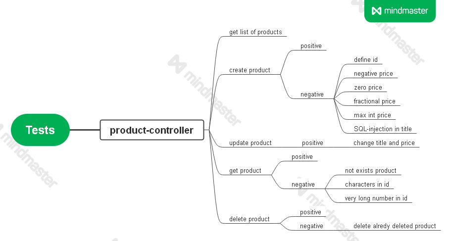

#Homework 6 Morozova
##Настройка
1. Переименовать

        /src/main/resources/generatorConfig.xml-default -> /src/main/resources/generatorConfig.xml
        /src/main/resources/mybatisConfig.xml-default -> /src/main/resources/mybatisConfig.xml
        /src/test/resources/application.properties-default -> /src/test/resources/application.properties

2. Прописать параметры доступа к БД

##Тест-кейсы:
- Получить список продуктов
- Создать продукт
- Создать продукт c указанным id
- Создать продукт с отрицательной ценой
- Создать продукт с нулевой ценой 
- Создать продукт с нецелочисленной ценой
- Создать продукт с ценой MAX_INT
- Создать продукт с sql-инъекцией в названии
- Изменить название и цену продукта
- Получить информацию о существуещем продукте
- Получить информацию о не существуещем продукте
- Получить информацию о продукте сo строкой вместо id 
- Получить информацию о продукте очень длинным id 
- Удалить продукт
- Удалить не существующий продукт
- Удалить ранее удаленный продукт

